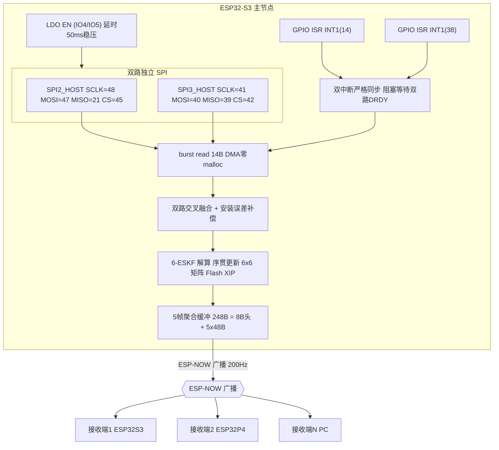
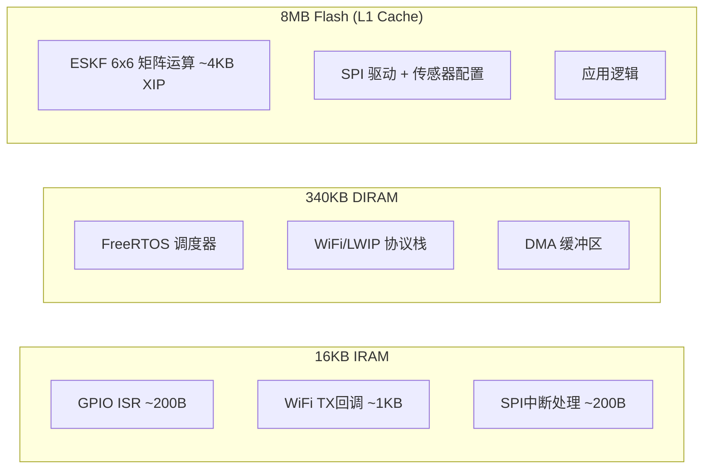
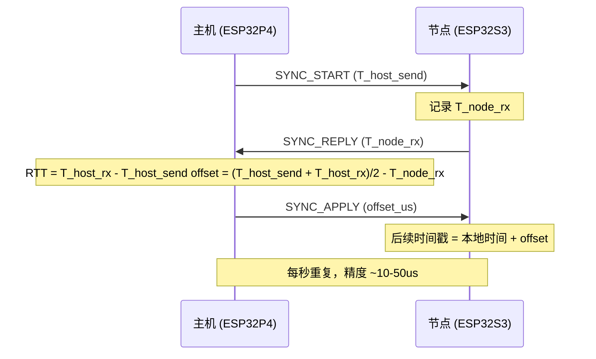

# SomatoSync — 康复医疗全身动作追踪节点

> 面向全国大学生物联网设计竞赛，基于 ESP32-S3 + 双路 ICM-42688-P 的高频体态监测节点，专为 12 节点全身动作捕捉场景设计。

## 功能特性

| 模块 | 功能 |
|------|------|
| **双路独立 SPI (SPI2+SPI3)** | 物理层彻底隔离，零总线冲突，极限 DMA 吞吐量 |
| **双硬件中断严格同步** | INT1 双路阻塞同步，消除双晶振时钟漂移，保障 1000Hz 物理对齐 |
| **LDO 强控上电时序** | IO4/IO5 独立控制 TPS7A2033，延时 50ms 稳压，杜绝错过首个中断沿 |
| **6-ESKF 姿态解算** | 纯 C 展开 6x6 矩阵序贯更新，零矩阵求逆，零动态内存分配 |
| **极速四元数协议** | 纯四元数数据帧 (48B/帧)，彻底移除欧拉角与温度冗余 |
| **5帧聚合 ESP-NOW** | 1000Hz 解算 / 200Hz 广播，248B 载荷完美贴附 250B 物理上限 |
| **动态 MAC 衍生 ID** | MAC 末字节自动推演 Node ID，单一固件 12 节点无脑烧录 |
| **全局时钟同步** | 三步同步协议，多节点微秒级时间对齐 |
| **零 malloc DMA 缓冲** | init 时预分配 32B DMA 缓冲，1kHz 读取零内存碎片 |
| **防死锁异步收发** | ESP-NOW recv 回调零阻塞，队列 + 专用任务级发送 |

## 项目结构

```
ESP_ICM42688/
├── components/
│   ├── icm42688/
│   │   ├── include/
│   │   │   ├── icm42688.h            # SPI 驱动 + 中断 API
│   │   │   ├── icm42688_reg.h        # 寄存器定义 & 量程枚举
│   │   │   ├── icm42688_alg.h        # 四元数/欧拉角工具
│   │   │   ├── icm42688_dual.h       # 双路融合 + 矩阵运算
│   │   │   └── hardcore_eskf.h       # 6状态 ESKF 滤波器
│   │   └── src/
│   │       ├── icm42688.c            # SPI 驱动 + DMA 缓冲 + 中断 ISR
│   │       ├── icm42688_alg.c        # 四元数工具
│   │       ├── icm42688_dual.c       # 双路融合 → ESKF
│   │       └── hardcore_eskf.c       # ESKF 核心 (Flash XIP)
│   └── net_send/
│       ├── include/
│       │   ├── net_send.h            # ESP-NOW + 聚合包定义
│       │   └── time_sync.h           # 全局时钟同步协议
│       └── src/
│           ├── net_send.c            # ESP-NOW + NVS + 异步收发
│           └── time_sync.c           # 三步时钟同步
├── main/main.c                       # 主程序: LDO→SPI→校准→双中断→融合→聚合
├── examples/espnow_receiver/         # 接收端示例
├── tools/                            # Python 监控/接收脚本
├── partitions_8mb.csv                # 自定义分区表
└── sdkconfig.defaults                # 含 IRAM/Flash/PSRAM 优化配置
```

## 硬件连接

| 信号 | IMU-A (SPI2) | IMU-B (SPI3) |
|------|-------------|-------------|
| SCLK | GPIO 48 | GPIO 41 |
| MOSI | GPIO 47 | GPIO 40 |
| MISO | GPIO 21 | GPIO 39 |
| CS | GPIO 45 | GPIO 42 |
| INT1 | GPIO 14 | GPIO 38 |
| LDO EN | GPIO 4 | GPIO 5 |

## 快速开始

```bash
idf.py set-target esp32s3
idf.py reconfigure
idf.py build
idf.py -p COMx flash monitor
```

接收端：将 `examples/espnow_receiver/` 烧录到另一块 ESP32 即可自动接收。

## 架构设计

### 系统架构



### 硬件资源分配



### 双硬件中断严格同步

两路 IMU 各自通过 INT1 引脚连接独立 GPIO。主循环阻塞等待双路 Data Ready 均触发后才进入读取，彻底消除双晶振长时运行导致的时钟漂移：

```
ICM42688-A INT1 → GPIO14 → ISR → ┐
                                    ├→ 信号量 → 高优先级任务唤醒
ICM42688-B INT1 → GPIO38 → ISR → ┘
                                   (任一路超时2ms则降级读取单路)
```

### 6状态 ESKF 算法

采用 Error-State Kalman Filter，纯 C 展开 6x6 矩阵运算，**无 malloc、无锁、零矩阵求逆**：

| 特性 | 说明 |
|------|------|
| **状态维度** | 6维：角度误差(3) + 陀螺仪零偏(3) |
| **预测步** | 陀螺仪积分更新名义四元数，F 矩阵传播协方差 |
| **更新步** | 加速度计序贯更新，3次标量运算（彻底消灭矩阵求逆） |
| **零偏估计** | 实时估计并补偿陀螺仪零偏漂移 |
| **内存布局** | ISR 常驻 IRAM；RTOS 运行 DIRAM；ESKF 代码运行 Flash XIP |

### 全局时钟同步协议



## 数据协议

### 聚合数据包 (极速四元数模式)

**单帧: 48 Bytes** — 仅保留四元数 + 惯性数据，彻底剔除欧拉角与温度冗余。

| 偏移 | 类型 | 字段 | 大小 |
|------|------|------|------|
| 0~11 | float x3 | accel (g) | 12B |
| 12~23 | float x3 | gyro (dps) | 12B |
| 24~39 | float x4 | quat [w,x,y,z] | 16B |
| 40~47 | uint64 | timestamp_us | 8B |

**聚合包: 248 Bytes** — 8B 包头 + 5x48B 帧，严格 < 250B ESP-NOW 物理上限。

| 偏移 | 字段 | 说明 |
|------|------|------|
| 0~3 | magic | `{'I','M','U','A'}` |
| 4 | node_id | MAC 衍生动态 ID |
| 5 | frame_count | 1~5 |
| 6~7 | reserved | 对齐 |
| 8~247 | frames[5] | 5帧 IMU 数据 |

### 时间同步包 (13 字节)

| 偏移 | 类型 | 字段 |
|------|------|------|
| 0 | uint8 | type (0xFD) |
| 1 | uint8 | node_id |
| 2~5 | uint32 | seq |
| 6~13 | int64 | host_time_us |
| 14~21 | int64 | node_time_us |
| 22~29 | int64 | offset_us |

## 关键参数

| 参数 | 参数值 |
|------|--------|
| Flash | 8MB |
| PSRAM | 16MB (Quad, 80MHz) |
| 分区表 | partitions_8mb.csv (3MB app + 5MB storage) |
| IMU 采样率 | 1000Hz (中断驱动，双路严格同步) |
| ESP-NOW 发送率 | 200Hz (5帧聚合) |
| 单包载荷 | 248B < 250B 上限 |
| 支持节点数 | 12 (动态 MAC ID，零配置) |
| 全局时钟精度 | ~10-50us |

## 串口输出示例

```
=== 双 ICM-42688-P + ESP-NOW ===
LDO EN1(IO4) + EN2(IO5) 拉高, 等待 50ms 稳压...
LDO 稳压完成, 开始 SPI 初始化
SPI2 bus initialized (shared)
WHO_AM_I = 0x47
SPI3 bus initialized (shared)
WHO_AM_I = 0x47
Interrupt configured on GPIO 14 (falling edge, DRDY)
Interrupt configured on GPIO 38 (falling edge, DRDY)
请保持传感器静止, 开始交叉校准...
校准后加速度 RMSE: 0.0089 g
=== 校准完成 ===
ESP-NOW 就绪 (MAC:AA:BB:CC:DD:EE:FF → node_id=0xFF)
=== 极速四元数模式 (1000Hz采样, 5帧聚合→200Hz发送) ===

[20] QW=0.9998 Conf=98% | TX✓ | TX:200
  IMU-A: ON (IRQ:20000) | IMU-B: ON (IRQ:20000) | Sync:OK #100
```

## License

MIT
